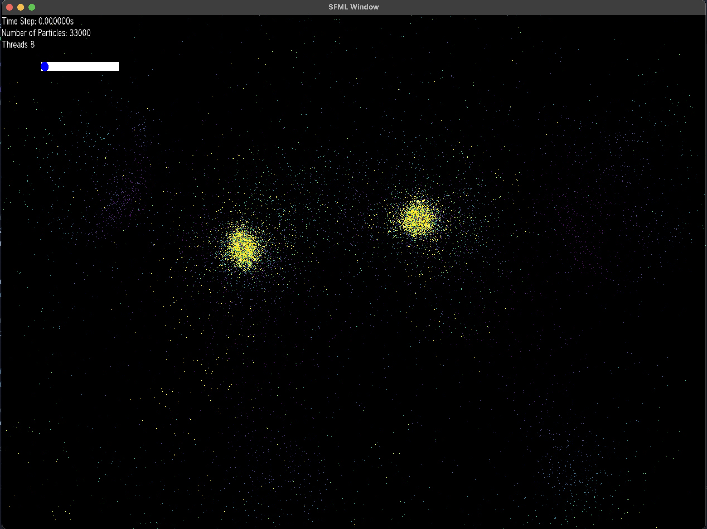

# Particle Gravity Simulator

This is a simple particle gravity simulator implemented in C++ using SFML.


## Prerequisites

- C++ Compiler (GCC, Clang, MSVC)
- CMake

## Compile Instructions

1. Clone the repository
2. Navigate into the project directory
3. Initialize the SFML submodule
```git submodule update --init --recursive```


4. Create a build folder and navigate in it
```mkdir build``` & ```cd build```

5. Compile the project: 
 
- On Linux/Mac:
  ```
  cmake ..
  make
  ```
- On Windows (with MSVC):
  ```
  cmake ..
  cmake --build .

  ```
  The exe will be located in debug. You need to move the exe file in to one level up in to build.
